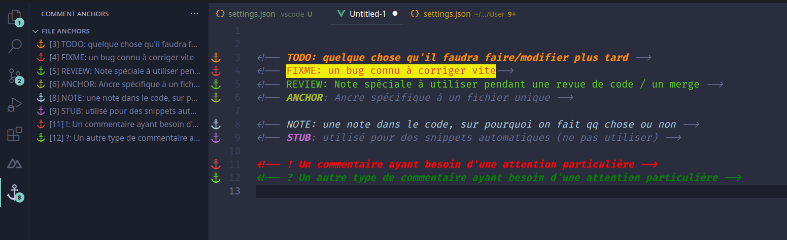

# CryptoSquare


## Développement

Ancres disponibles avec commentAnchors :




### Workflow git

Voir la convention de [nommage des branches d'IFS](https://docs.ifs.com/techdocs/21r2/020_lifecycle/030_customer_solution_development/010_working_with_git/010_git_naming_standards/)

```bash

git checkout -b topic/VotreTrigramme/<M|B|R>-<id de l issue>-description

# Exemple
git checkout -b topic/CPR/M-0001-Description
```

## Couleurs à utiliser

- white
- black
- deepblue (primary)
- neonblue (secondary)
- mauve (accent)