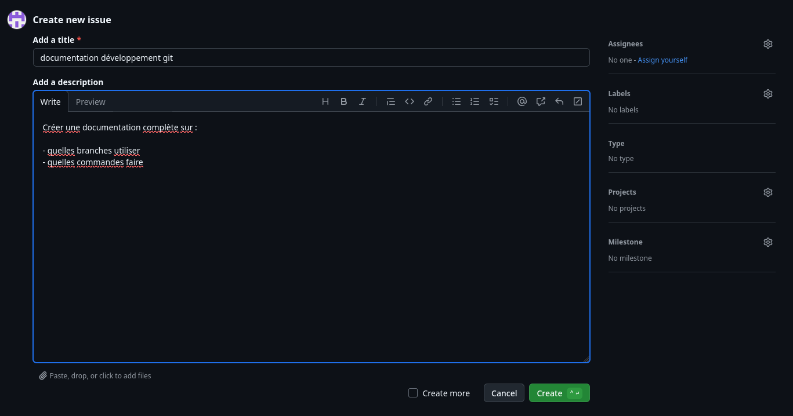
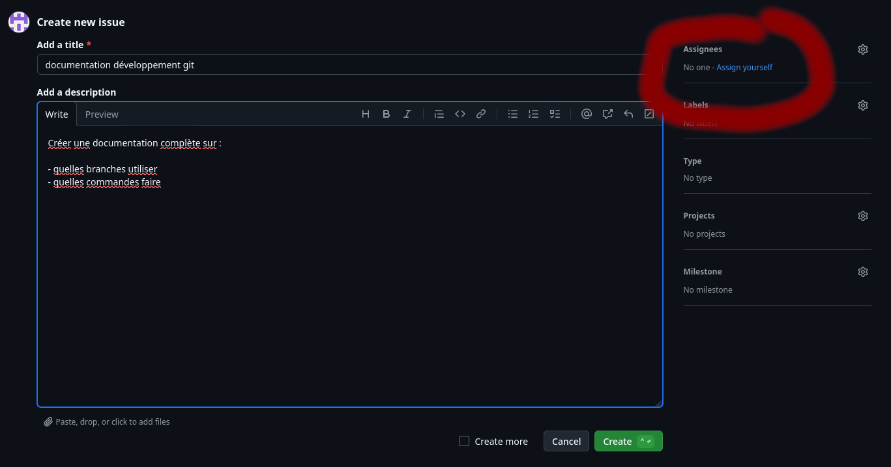
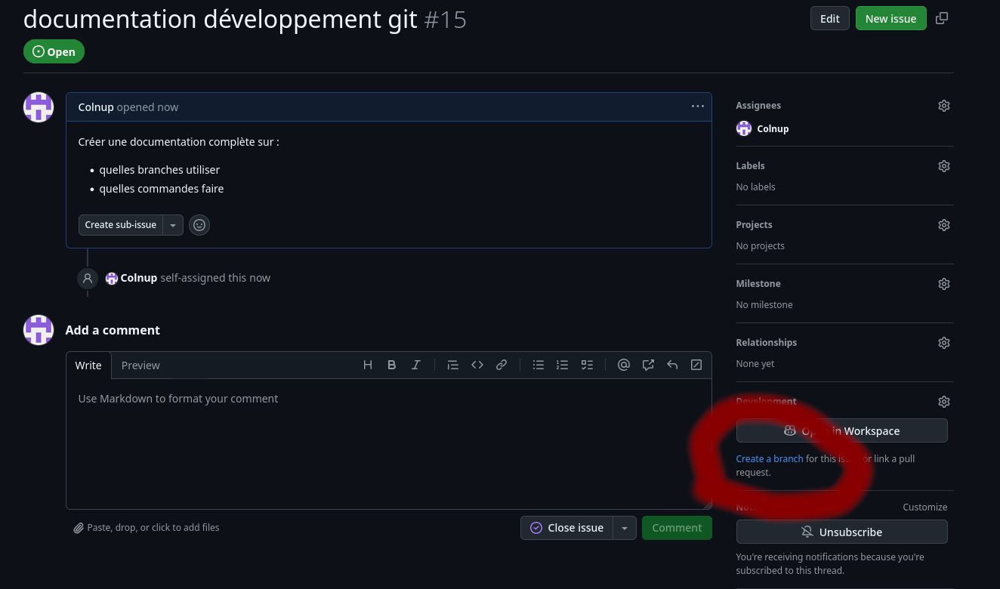
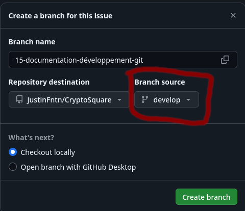
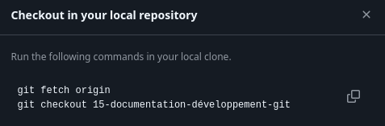

# Procédure GIT

Quelle que soit la charge de travail (1 petit fix ou une grande feature), vous **devez** vous conformer à la procédure suivante *avant de commencer quelque développement que ce soit*:

1. Créer une issue sur Github
  - placer un court titre descriptif
  - ajouter des éventuelles précisions dans la description
  - S'assigner soi-même si on compte répondre à l'issue

2. Créer une branche de développement

  - Créer la branche

  - **Changer pour qu'elle se base sur `develop`**

  - Copier les lignes de commande fournies et les coller dans un terminal sur votre ordi

3. Faire vos changements et commit (en suivant la conventionnal commit)
  - suivre `type(sujet): message descriptif`
  - Types autorisés: feat, fix build, chore, ci, docs, style, refactor, perf, test
  - le sujet est optionnel
  - la totalité du message doit faire < 100 caractères
  - *ex: `git commit -m "feat: ajout du système d'authentification"`*

4. `git pull` *puis* `git push`

5. Créer une pull request sur github:

